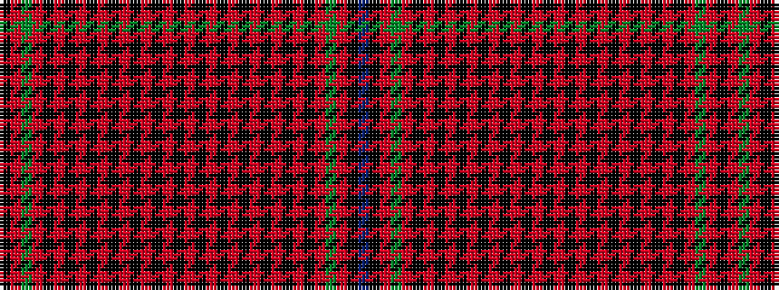

BKRGRKRKRKRKRKRKRKRKRKRKRKRKRKRGRK

It is a 34 stripe tartan.

<figure class="pat-woven">

<figcaption>idealised sample</figcaption>
</figure>

## Colour Sequence



## Tartans with this colour sequence

| Tartans |
|---------------|
| [Hebrides #3](/setts/s34/k10r2g2r2k10r2k10r1k2r1k10r1k2r1k10r1k2r1k10r1k2r1k10r1k2r1k10r2k10r2g2r2k10b2~x2/)|
||
