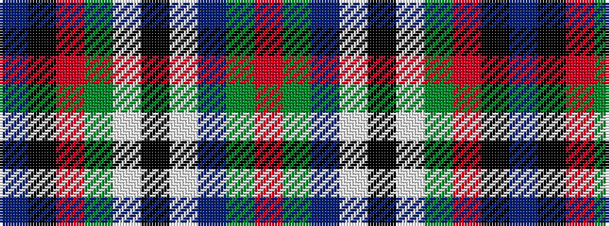

BKRGWKWBGR

It is a 10 stripe tartan.

<figure class="pat-woven">

<figcaption>idealised sample</figcaption>
</figure>

## Colour Sequence



## Tartans with this colour sequence

| Tartans |
|---------------|
| [Steiff](/setts/s10/r15g6db36w2k6w2g30r32k6t4/)|
||
