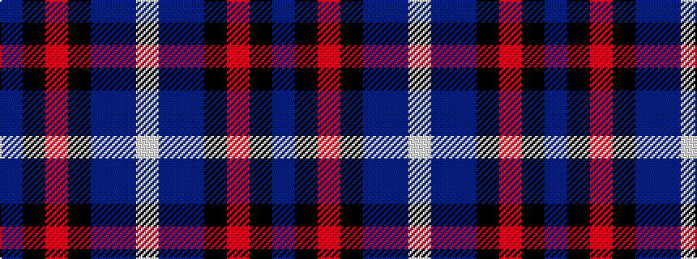

BKRKBBW

It is a 7 stripe tartan.

<figure class="pat-woven">

<figcaption>idealised sample</figcaption>
</figure>

## Colour Sequence



## Tartans with this colour sequence

| Tartans |
|---------------|
| [Colleges Scotland (Corp)](/variants/s7/b1k50r1k2n4db7w1~x2/)|
||
