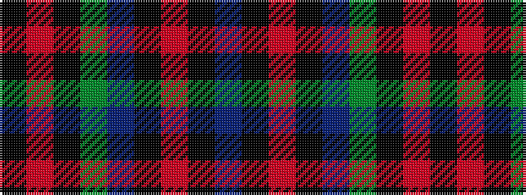

BKRKBGKRK

It is a 9 stripe tartan.

<figure class="pat-woven">

<figcaption>idealised sample</figcaption>
</figure>

## Colour Sequence



## Tartans with this colour sequence

| Tartans |
|---------------|
| [Johnstons of Elgin Bicentennial (Com](/variants/s9/k25r14k8y14b5k12o6k8bi2~x2/)|
||
