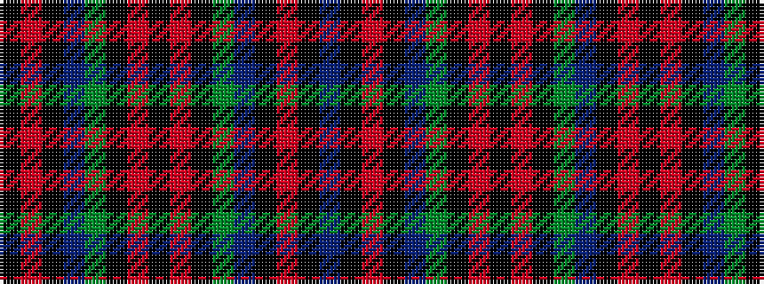

BKRKBGKRKRKGBKRK

It is a 16 stripe tartan.

<figure class="pat-woven">

<figcaption>idealised sample</figcaption>
</figure>

## Colour Sequence



## Tartans with this colour sequence

| Tartans |
|---------------|
| [Johnstons of Elgin Bicentennial](/setts/s16/k8o6k12b5y14k8r14k25r14k8y14b5k12o6k8b2~x2/)|
||
