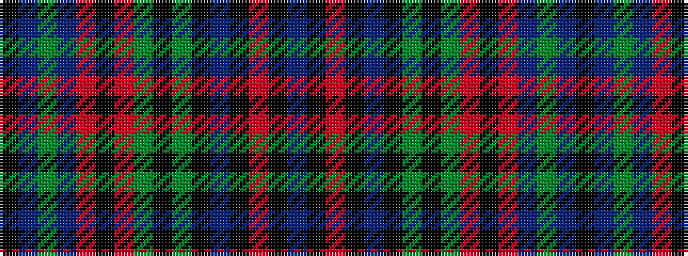

BKRKBKGKGRKRBGBK

It is a 16 stripe tartan.

<figure class="pat-woven">

<figcaption>idealised sample</figcaption>
</figure>

## Colour Sequence



## Tartans with this colour sequence

| Tartans |
|---------------|
| [Yeomans (2016)](/setts/s16/dt22k2o3k2dt22k4dg10k2dg10r3k4r3do10dg2do10k3~x2/)|
||
