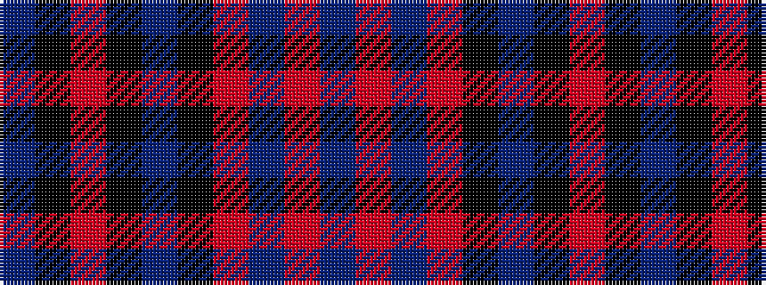

BKRKBKRBRB

It is a 10 stripe tartan.

<figure class="pat-woven">

<figcaption>idealised sample</figcaption>
</figure>

## Colour Sequence



## Tartans with this colour sequence

| Tartans |
|---------------|
| [Lochaber (Ingles Buchan)](/variants/s10/do6o4n22r4k22do22k2r5k2do6~x2/)|
||
