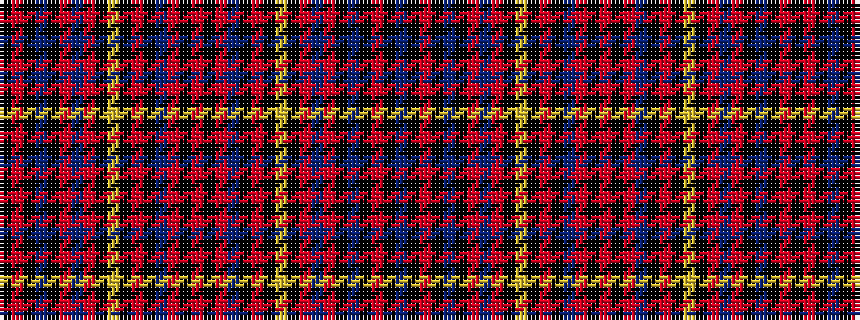

BKRKBKRBRKYKRKBRKRKRBKRKYKRBRKBKRK

It is a 34 stripe tartan.

<figure class="pat-woven">

<figcaption>idealised sample</figcaption>
</figure>

## Colour Sequence



## Tartans with this colour sequence

| Tartans |
|---------------|
| [Grand Lodge of Canada (Corporate)](/setts/s34/t5k1r15k2t3k10r5db15r5k2ly4k2r1k2db15r15k4r2~x2/)|
||
