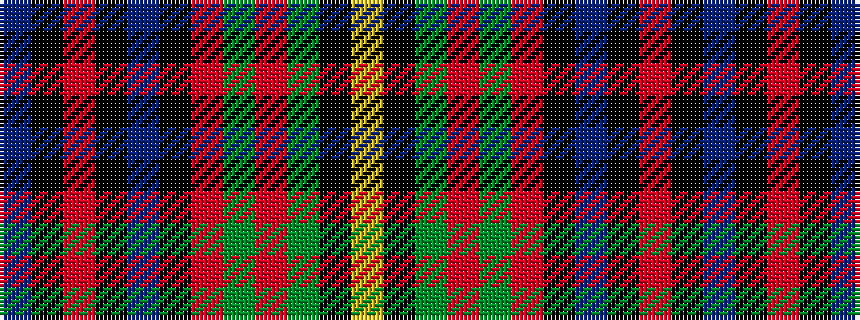

BKRKBKRGRGKY

It is a 12 stripe tartan.

<figure class="pat-woven">

<figcaption>idealised sample</figcaption>
</figure>

## Colour Sequence



## Tartans with this colour sequence

| Tartans |
|---------------|
| [State Seal of New Jersey (Fashion)](/variants/s12/b6k1r4k1b38k17o12dy5o5dy25k1lo4~x2/)|
||
