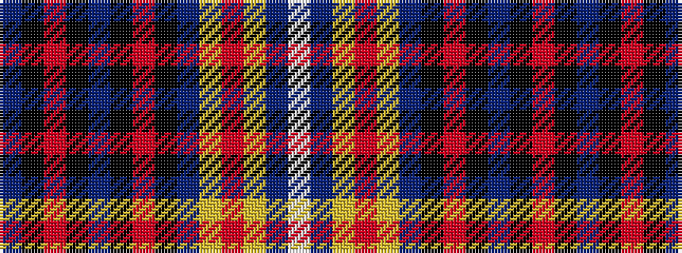

BKRKBKRKBYRYBW

It is a 14 stripe tartan.

<figure class="pat-woven">

<figcaption>idealised sample</figcaption>
</figure>

## Colour Sequence



## Tartans with this colour sequence

| Tartans |
|---------------|
| [Rabbinical (Corporate)](/variants/s14/b28k1r7k1b6k1o4k1b6ly2r3ly2b4w6~x2/)|
||
