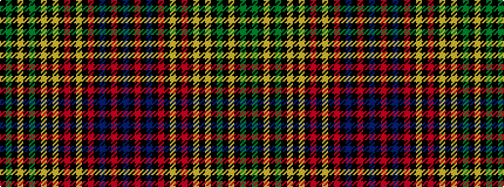

BKRKBKRKYKRKYKYKGKYKGK

It is a 22 stripe tartan.

<figure class="pat-woven">

<figcaption>idealised sample</figcaption>
</figure>

## Colour Sequence



## Tartans with this colour sequence

This pattern is a design lineage: every tartan below shares one colour order, whatever its owner —
near-identical designs are grouped, the largest lineage first (#112: the pattern is a tartan's
second parent, beside its family or clan).

<table class="sett-table">
<tbody>
<tr><td><a href="/variants/s22/k8dg25k1ly8k1g2k1ly8k1lo25k8r8k1ly2k1r8k8db8k1r2k1db8~x2/">Rosalyn</a></td></tr>
<tr><td class="sett-swatch"></td></tr>
<tr class="cluster-sep"><td></td></tr>
<tr><td><a href="/variants/s22/k16g50k2ly16k2dg4k2ly16k2lo50k16r16k2ly4k2r16k16t1k2r4k2t16~x2~g1903114-dg1806142/">Rosalyn (Fashion)</a></td></tr>
<tr><td class="sett-swatch"></td></tr>
</tbody>
</table>

