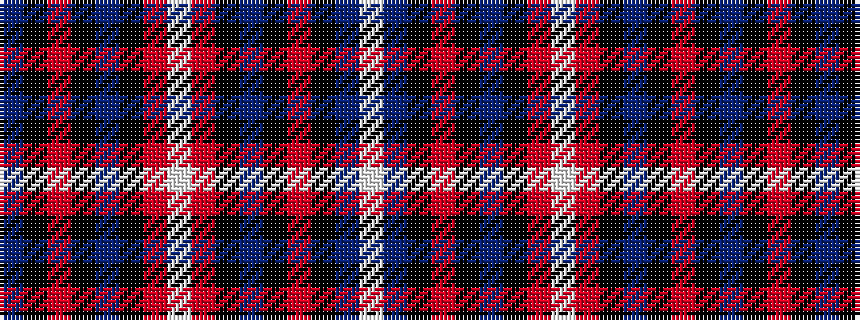

BKRKBKRWRKBKRKBW

It is a 16 stripe tartan.

<figure class="pat-woven">

<figcaption>idealised sample</figcaption>
</figure>

## Colour Sequence



## Tartans with this colour sequence

| Tartans |
|---------------|
| [Royal Naval Association](/setts/s16/db14k21r2k3db4k21r3w3r3k21db4k3r2k21db14w3~x2/)|
||
