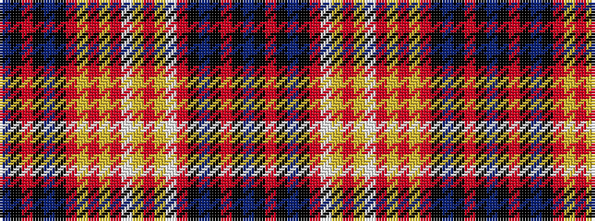

BKRKBKRWYRYWRYRYRKBKRKB

It is a 23 stripe tartan.

<figure class="pat-woven">

<figcaption>idealised sample</figcaption>
</figure>

## Colour Sequence



## Tartans with this colour sequence

| Tartans |
|---------------|
| [Unidentified #13](/variants/s23/db8k2r7k2db8k2r33w93ly3r3ly3w34r98ly3r3ly3r33k2db8k2r7k2db8~x2/)|
||
