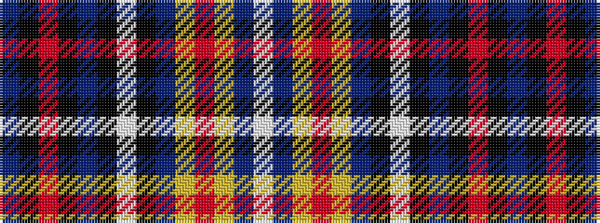

BKRKBKWKBYRYBW

It is a 14 stripe tartan.

<figure class="pat-woven">

<figcaption>idealised sample</figcaption>
</figure>

## Colour Sequence



## Tartans with this colour sequence

| Tartans |
|---------------|
| [Rabbinical](/variants/s14/db28k1r7k1db6k1wi4k1db6ly2r3ly2db4w6~x2/)|
||
