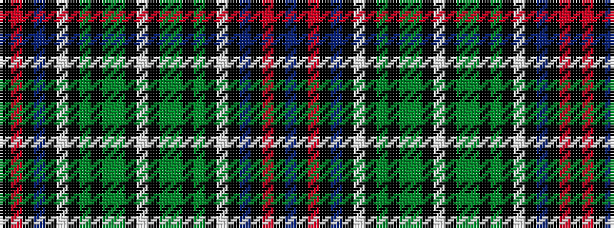

BKRKBKWKGKGGKWKGGKGKWKBKRK

It is a 26 stripe tartan.

<figure class="pat-woven">

<figcaption>idealised sample</figcaption>
</figure>

## Colour Sequence



## Tartans with this colour sequence

| Tartans |
|---------------|
| [Strathclyde, University of](/variants/s26/db7k1r3k1db24k1w3k3y3k3y3g19k2w4~x2/)|
||
