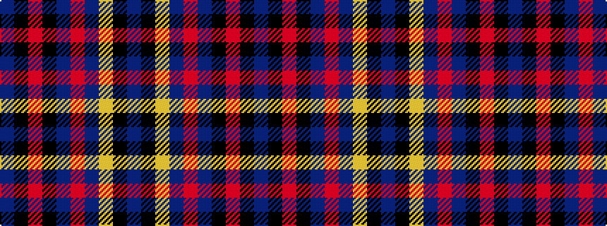

BKRKBRBYKB

It is a 10 stripe tartan.

<figure class="pat-woven">

<figcaption>idealised sample</figcaption>
</figure>

## Colour Sequence



## Tartans with this colour sequence

| Tartans |
|---------------|
| [Mead (Personal)](/setts/s10/b36k3r6k3dt10r5dt3ly4k1b2~x2/)|
||
| [Mead (Tennessee) Modern Dress (Personal)](/setts/s10/dbi36k3r6k3db10r5db3ly4k1dbi2~x2/)|
||
