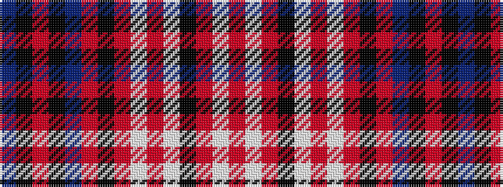

BKRKBRKRWRWKRWR

It is a 15 stripe tartan.

<figure class="pat-woven">

<figcaption>idealised sample</figcaption>
</figure>

## Colour Sequence



## Tartans with this colour sequence

| Tartans |
|---------------|
| [Anderson Blue](/variants/s15/t8k1o1k1t22o1k14o1w2o1w6k3o1w3o1~x2/)|
||
