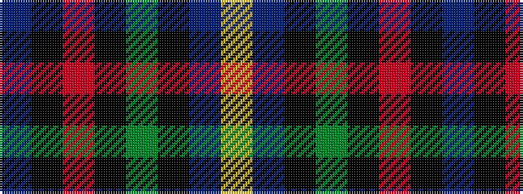

BKRKGKBY

It is a 8 stripe tartan.

<figure class="pat-woven">

<figcaption>idealised sample</figcaption>
</figure>

## Colour Sequence



## Tartans with this colour sequence

| Tartans |
|---------------|
| [Kilgour (Asymmetrical)](/variants/s8/db6k3r14k3g14k3db6ly1~x4/)|
||
| [St. Clement of Rome (Corporate)](/variants/s8/db18k5r26k5g25k5db18ly2~x2/)|
||
