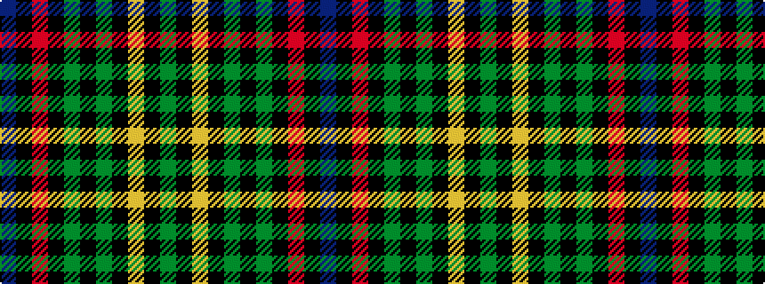

BKRKGKGKYKG

It is a 11 stripe tartan.

<figure class="pat-woven">

<figcaption>idealised sample</figcaption>
</figure>

## Colour Sequence



## Tartans with this colour sequence

| Tartans |
|---------------|
| [Rourke-Frew Hunting](/setts/s11/db6k3r2k3dg31k6dg2k6lo13k2dg2~x2/)|
||
| [Rourke-Frew Hunting](/setts/s11/db6k3r2k3dg31k6y2k6lo13k2y2~x2/)|
||
