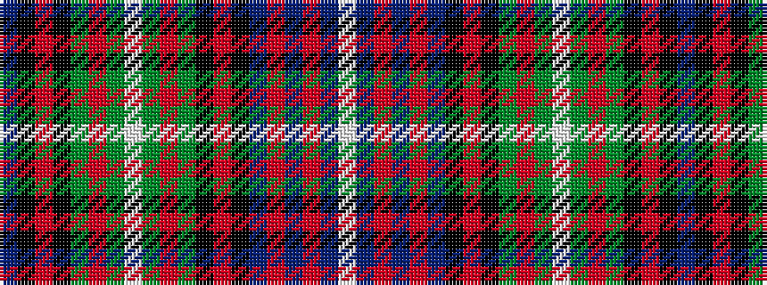

BKRKGRGWGRGKRKBRBRBW

It is a 20 stripe tartan.

<figure class="pat-woven">

<figcaption>idealised sample</figcaption>
</figure>

## Colour Sequence



## Tartans with this colour sequence

| Tartans |
|---------------|
| [Ranking (Personal)](/setts/s20/db33k3r2k3g9r2g7w2g7r2g9k3r2k3db7r2db2r2db3w2~x2/)|
||
| [Ranking Corporate Tartan Tartan Number: 3242. Earliest known date: 2002 Personal/Family tartan for the Ranking family and its close relatives as determined by the current head of the family. A minor variation of Rankine tartan. See products available Copyright © Blair Urquhart, Comrie, 2015](/setts/s20/dt36k5r2k5g15r2g10w2g10r2g15k5r2k5dt10r2dt2r2dt4w2~x2/)|
||
