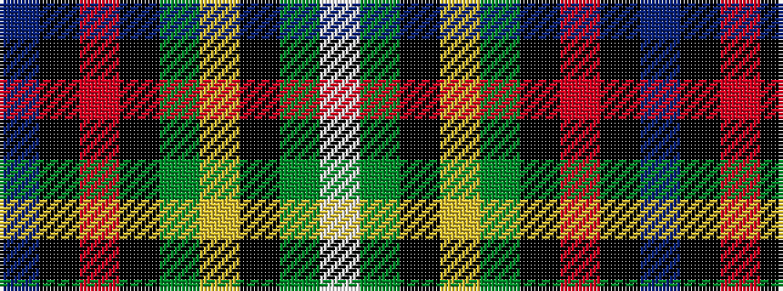

BKRKGYKGW

It is a 9 stripe tartan.

<figure class="pat-woven">

<figcaption>idealised sample</figcaption>
</figure>

## Colour Sequence



## Tartans with this colour sequence

| Tartans |
|---------------|
| [Roderick Dhu](/setts/s9/b3k2r2k12g10ly1k1g2lb2~x4/)|
||
