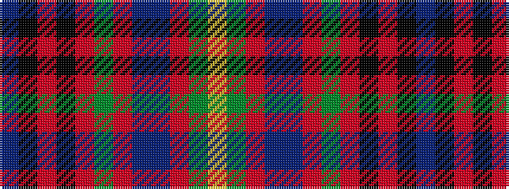

BKRKRGRBBRGY

It is a 12 stripe tartan.

<figure class="pat-woven">

<figcaption>idealised sample</figcaption>
</figure>

## Colour Sequence



## Tartans with this colour sequence

| Tartans |
|---------------|
| [Gordonstoun](/variants/s12/ly4g20r3db11t3r11g11r3k20r3k3t3~x2/)|
||
