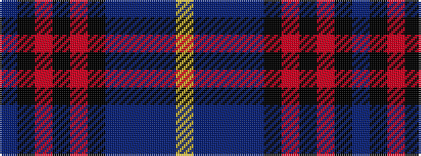

BKRKRKBBBBY

It is a 11 stripe tartan.

<figure class="pat-woven">

<figcaption>idealised sample</figcaption>
</figure>

## Colour Sequence



## Tartans with this colour sequence

| Tartans |
|---------------|
| [Concours of Elegance](/setts/s11/db130k18m6k6m6k6b18db14b5db18lo4/)|
||
