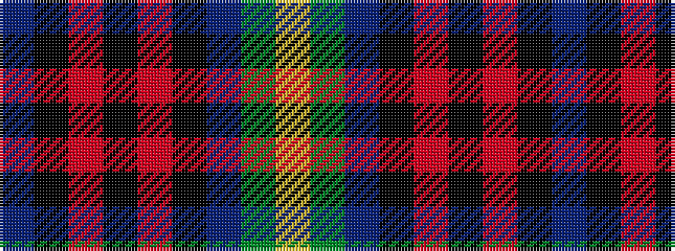

BKRKRKBGY

It is a 9 stripe tartan.

<figure class="pat-woven">

<figcaption>idealised sample</figcaption>
</figure>

## Colour Sequence



## Tartans with this colour sequence

| Tartans |
|---------------|
| [Knockando Woolmill (Corporate)](/setts/s9/t16k1r7k1r7k1t7y24lo4~x2/)|
||
