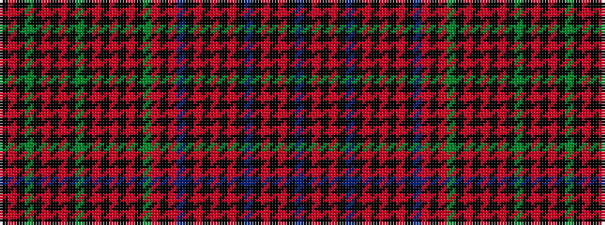

BKRKRKBKRKRKRKBRKRGKRKRKRKGKRKRKGKRK

It is a 36 stripe tartan.

<figure class="pat-woven">

<figcaption>idealised sample</figcaption>
</figure>

## Colour Sequence



## Tartans with this colour sequence

| Tartans |
|---------------|
| [Weiss-Halliwell (Personal)](/setts/s36/dp6k1o1k2o1k1dp6k1o22k3o1k3o10k1dp3o1k6o1dg3k1o10k3o1k3o22k1dg6k1o1k2o1k1dg6k1o12k1~x2/)|
||
