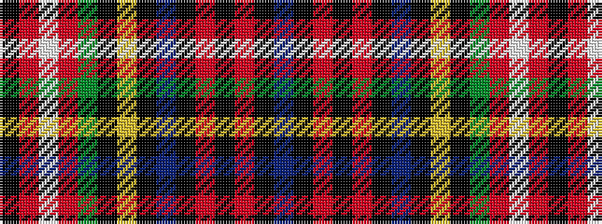

BKRKRKBKYKGRWRK

It is a 15 stripe tartan.

<figure class="pat-woven">

<figcaption>idealised sample</figcaption>
</figure>

## Colour Sequence



## Tartans with this colour sequence

| Tartans |
|---------------|
| [Unidentified #16](/setts/s15/db6k3r4k2r27k12db10k3ly2k3dg12r10w2r3k3~x2/)|
||
| [Unidentified 30](/setts/s15/db6k3r4k2r27k12db10k3ly2k3g12r10w2r3k3~x2/)|
||
