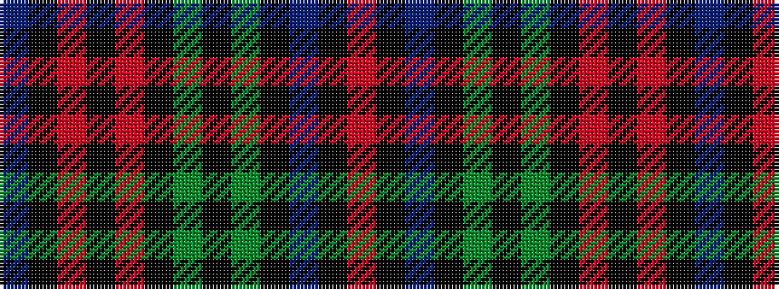

BKRKRKGKGKBKR

It is a 13 stripe tartan.

<figure class="pat-woven">

<figcaption>idealised sample</figcaption>
</figure>

## Colour Sequence



## Tartans with this colour sequence

| Tartans |
|---------------|
| [Red Hackle (Military)](/variants/s13/dp11k1ri1k1ri1k7dg8k1dg8k7dp8k1r1~x4/)|
||
| [The Red Hackle](/variants/s13/db23k2ri2k2ri2k16g17k2g17k15db17k2r2~x2/)|
||
