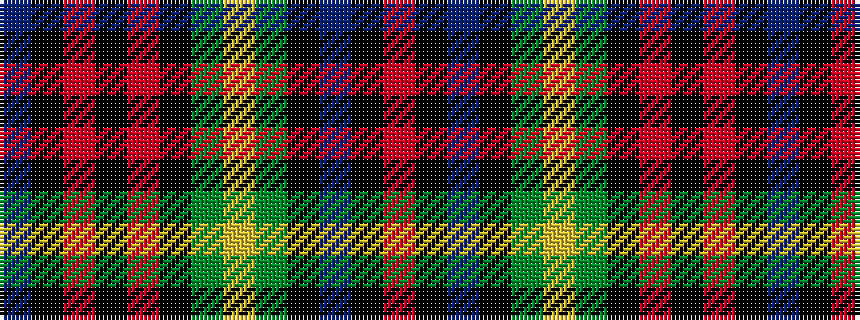

BKRKRKGYGKBKR

It is a 13 stripe tartan.

<figure class="pat-woven">

<figcaption>idealised sample</figcaption>
</figure>

## Colour Sequence



## Tartans with this colour sequence

| Tartans |
|---------------|
| [Black Watch Plaid of Pipers](/variants/s13/db12k2r2k2r2k12g11ly2g11k12db11k2r2~x2/)|
||
