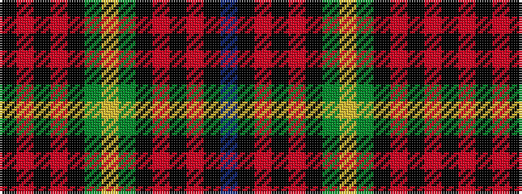

BKRKRKGYGKRKRK

It is a 14 stripe tartan.

<figure class="pat-woven">

<figcaption>idealised sample</figcaption>
</figure>

## Colour Sequence



## Tartans with this colour sequence

| Tartans |
|---------------|
| [Sinclair-Brown (Personal)](/setts/s14/db64k11r2k4r2k4g32lo4~x2/)|
||
