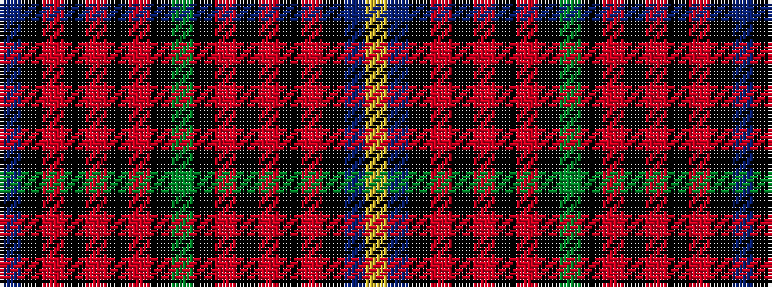

BKRKRKRKGKRKRKRKBY

It is a 18 stripe tartan.

<figure class="pat-woven">

<figcaption>idealised sample</figcaption>
</figure>

## Colour Sequence



## Tartans with this colour sequence

| Tartans |
|---------------|
| [Griffiths of Llangynin (Personal)](/setts/s18/db40k8r4k4r8k4r4k8dg40k8r4k4r8k4r4k8db40ly3~x2/)|
||
