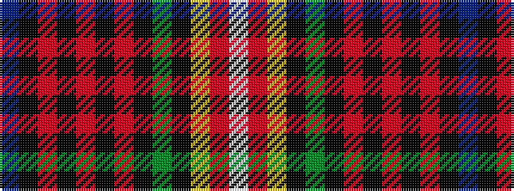

BKRKRKRKGKYRW

It is a 13 stripe tartan.

<figure class="pat-woven">

<figcaption>idealised sample</figcaption>
</figure>

## Colour Sequence



## Tartans with this colour sequence

| Tartans |
|---------------|
| [Unidentified No 158 Silk Fragment](/variants/s13/db8k1r4k1r4k1r4k1dg8k1ly1r1w1~x2/)|
||
| [Unnamed No 158, Silk Fragment](/variants/s13/db8k1r4k1r4k1r4k1g8k1ly1r1w1~x2/)|
||
