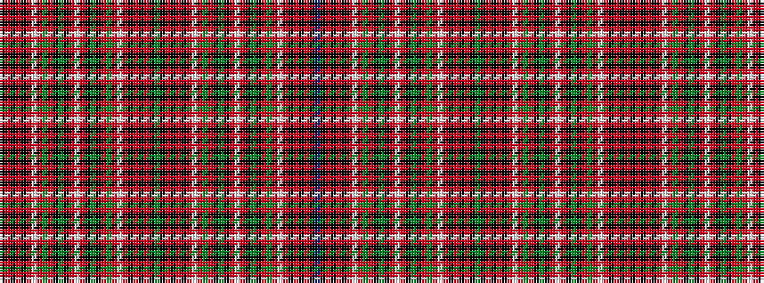

BKRKRKRWRGRKGKRWRKGKRGRWRKRKRKGKRKRKRWRGRKGKRWRKGKRGRWRKRKRK

It is a 60 stripe tartan.

<figure class="pat-woven">

<figcaption>idealised sample</figcaption>
</figure>

## Colour Sequence



## Tartans with this colour sequence

| Tartans |
|---------------|
| [Innes of Cowie](/setts/s60/k6r1k1r1k1r6w1r2g3r2k1g5k1r2w1r2k1g5k1r2g3r2w1r6k1r1k1r1k6g1k6r1k1r1k1r6w1r2g3r2k1g5k1r2w1r2k1g5k1r2g3r2w1r6k1r1k1r1k6db1~x4/)|
||
