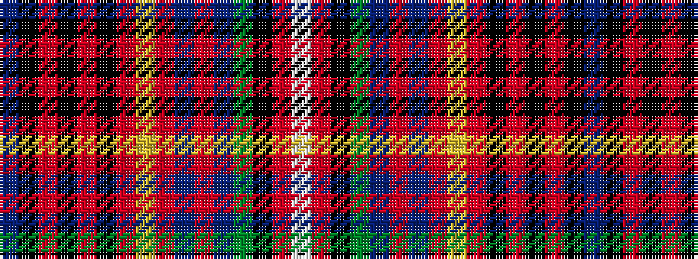

BKRKRKRYRBRBGKRW

It is a 16 stripe tartan.

<figure class="pat-woven">

<figcaption>idealised sample</figcaption>
</figure>

## Colour Sequence



## Tartans with this colour sequence

| Tartans |
|---------------|
| [Innes, hunting](/variants/s16/t3k18o3k4o3k3o18ly3o3db8o3db3g15k3o3w3~x2/)|
||
