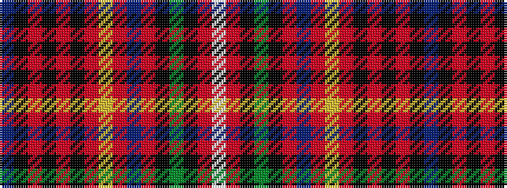

BKRKRKRYRBRKGKRW

It is a 16 stripe tartan.

<figure class="pat-woven">

<figcaption>idealised sample</figcaption>
</figure>

## Colour Sequence



## Tartans with this colour sequence

| Tartans |
|---------------|
| [Innes (Seven colours) (Clan)](/variants/s16/t7k24r4k4r4k4r24ly4r6db12r6k4g20k4r6w4/)|
||
| [Innes (of Moray)](/variants/s16/t4k22r3k3r3k3r22ly3r4db6r4k3dg18k3r6w3~x2/)|
||
