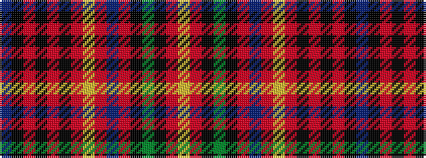

BKRKRKRYRBRKGKRY

It is a 16 stripe tartan.

<figure class="pat-woven">

<figcaption>idealised sample</figcaption>
</figure>

## Colour Sequence



## Tartans with this colour sequence

| Tartans |
|---------------|
| [Innes](/setts/s16/b7k24r4k4r4k4r24ly4r6db12r6k4dg20k4r6lr4~x2/)|
||
| [Innes](/setts/s16/b7k24r4k4r4k4r24ly4r6db12r6k4dg20k4r6lr4/)|
||
| [Innes D](/setts/s16/b3k12r2k2r2k2r12ly2r3db6r3k2dg10k2r3lr2~x2/)|
||
| [Innes D](/setts/s16/b3k12r2k2r2k2r12ly2r3db6r3k2dg10k2r3lr2/)|
||
