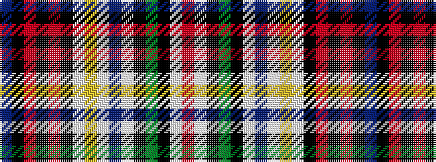

BKRKRKWYWBWKGKWR

It is a 16 stripe tartan.

<figure class="pat-woven">

<figcaption>idealised sample</figcaption>
</figure>

## Colour Sequence



## Tartans with this colour sequence

| Tartans |
|---------------|
| [Innes Dress](/setts/s16/t4k12r2k2r2k2w12ly2w3db6w3k2dg12k2w3r2~x2/)|
||
| [Innes Dress Clan Tartan Tartan Number: 360. Earliest known date: pre 2003 Inglis, or Ingles, tartan is a variation of the MacIntyre tartan recognised by Lord Lyon. The green stripe of the MacIntyre is replaced by yellow in the Inglis tartan. The pattern comes from the collection of the late James MacKinlay which he called MacIntyre or Inglis. MacKinlay collected samples of tartan between 1930 and 1950 but did not provide details of the origins of the specimens. The original MacIntyre tartan can be seen on a doublet at the Kingussie museum dated 1800. It was registered in the Public Register of All Arms and Bearings in 1955. See products available Copyright © Blair Urquhart, Comrie, 2015](/setts/s16/t4k12r2k2r2k2w12ly2w3db6w3k2g12k2w3r2~x2/)|
|![Innes Dress Clan Tartan Tartan Number: 360. Earliest known date: pre 2003 Inglis, or Ingles, tartan is a variation of the MacIntyre tartan recognised by Lord Lyon. The green stripe of the MacIntyre is replaced by yellow in the Inglis tartan. The pattern comes from the collection of the late James MacKinlay which he called MacIntyre or Inglis. MacKinlay collected samples of tartan between 1930 and 1950 but did not provide details of the origins of the specimens. The original MacIntyre tartan can be seen on a doublet at the Kingussie museum dated 1800. It was registered in the Public Register of All Arms and Bearings in 1955. See products available Copyright © Blair Urquhart, Comrie, 2015 example sett](/setts/s16/t4k12r2k2r2k2w12ly2w3db6w3k2g12k2w3r2~x2/sett.png)|
