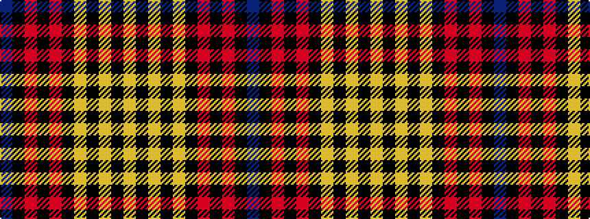

BKRKRKYKYKY

It is a 11 stripe tartan.

<figure class="pat-woven">

<figcaption>idealised sample</figcaption>
</figure>

## Colour Sequence



## Tartans with this colour sequence

| Tartans |
|---------------|
| [Rourke-Frew (Name)](/variants/s11/dt6k3r2k3r31k6lo2k6lo13k2lo2~x2/)|
||
