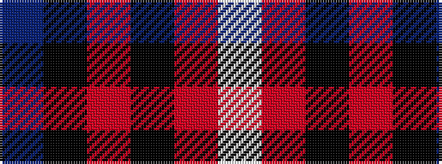

BKRKRW

It is a 6 stripe tartan.

<figure class="pat-woven">

<figcaption>idealised sample</figcaption>
</figure>

## Colour Sequence



## Tartans with this colour sequence

| Tartans |
|---------------|
| [Koot Wedding (Personal)](/setts/s6/dt48k32r1k8r3w3~x2/)|
||
| [Koot Wedding (Personal)](/setts/s6/db48k32r1k8r3w3~x2/)|
||
