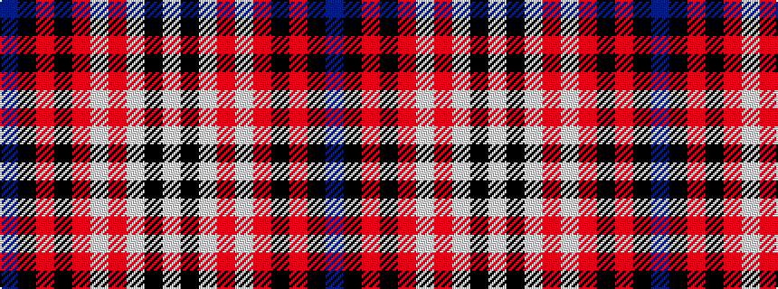

BKRKRWRWKW

It is a 10 stripe tartan.

<figure class="pat-woven">

<figcaption>idealised sample</figcaption>
</figure>

## Colour Sequence



## Tartans with this colour sequence

| Tartans |
|---------------|
| [Masai Shuka 11 (Artefact)](/variants/s10/p30k5r2k1r10w1r1w1k3w2~x4/)|
||
