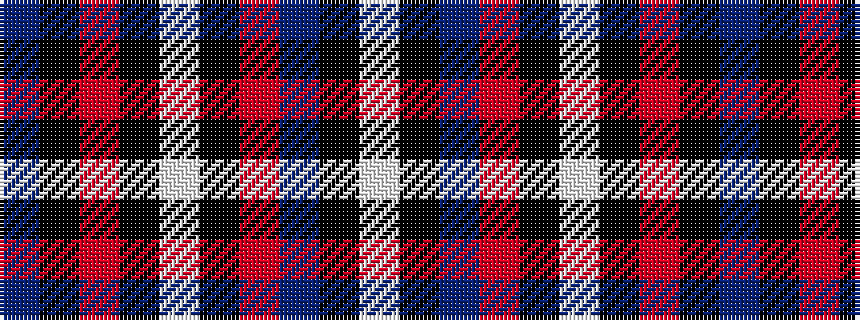

BKRKWKRBKW

It is a 10 stripe tartan.

<figure class="pat-woven">

<figcaption>idealised sample</figcaption>
</figure>

## Colour Sequence



## Tartans with this colour sequence

| Tartans |
|---------------|
| [Skye (Fashion)](/setts/s10/n50k12o2k2w2k2o12n7k7w2~x2/)|
||
