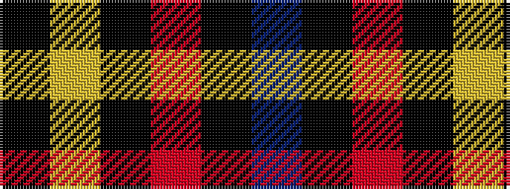

BKRKYK

It is a 6 stripe tartan.

<figure class="pat-woven">

<figcaption>idealised sample</figcaption>
</figure>

## Colour Sequence



## Tartans with this colour sequence

| Tartans |
|---------------|
| [Justus](/setts/s6/k8ly1k1r1k4db1~x12/)|
||
