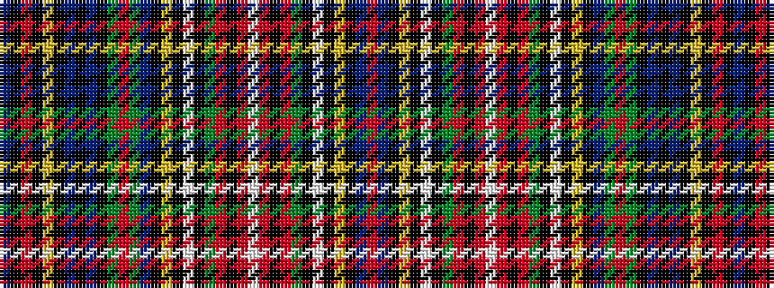

BKRKYKBKBKGRGBKYKWKGRKRWRKRGKWKYKBR

It is a 35 stripe tartan.

<figure class="pat-woven">

<figcaption>idealised sample</figcaption>
</figure>

## Colour Sequence



## Tartans with this colour sequence

| Tartans |
|---------------|
| [Duchess of Edinburgh](/setts/s35/r12t8k8ly2k2w2k2dg12r8k2r5w2r5k2r8dg12k2w2k2ly2k8t8dg32r4dg32k4db10k8db4k5ly2k4r4k4t12~x2/)|
||
| [Duchess of Edinburgh](/setts/s35/r12t8k8ly2k2w2k2g12r8k2r5w2r5k2r8g12k2w2k2ly2k8t8g32r4g32k4db10k8db4k5ly2k4r4k4t12~x2/)|
||
