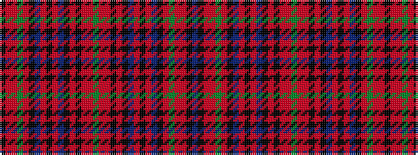

BKRRGRKBRKRBKRKRRGRRKRKBRKRBKRGRRK

It is a 34 stripe tartan.

<figure class="pat-woven">

<figcaption>idealised sample</figcaption>
</figure>

## Colour Sequence



## Tartans with this colour sequence

| Tartans |
|---------------|
| [Stuart/Stewart of Ardshiel](/setts/s34/dg14r6ri2k3r65k2t2r6k34r6t2k2r4dg66r12ri2k2t4/)|
||
