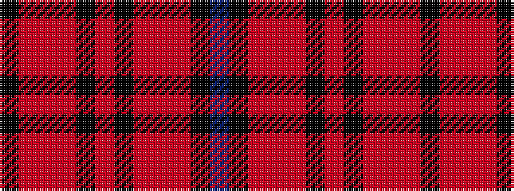

BKRRRKRKRRRK

It is a 12 stripe tartan.

<figure class="pat-woven">

<figcaption>idealised sample</figcaption>
</figure>

## Colour Sequence



## Tartans with this colour sequence

| Tartans |
|---------------|
| [Greyhound Grenadiers #2](/setts/s12/db9k7o5r1o5k1o2~x4/)|
||
