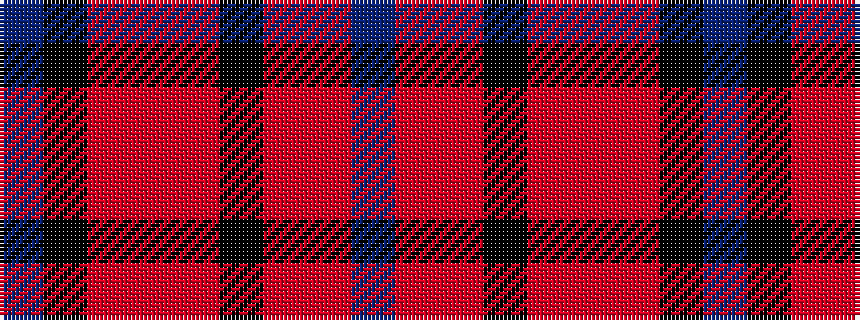

BKRRRKRRB

It is a 9 stripe tartan.

<figure class="pat-woven">

<figcaption>idealised sample</figcaption>
</figure>

## Colour Sequence



## Tartans with this colour sequence

| Tartans |
|---------------|
| [Clanton (Personal)](/setts/s9/dp1k2r7o4r2k4r7o2dp1~x4/)|
||
