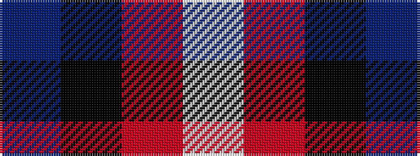

BKRW

It is a 4 stripe tartan.

<figure class="pat-woven">

<figcaption>idealised sample</figcaption>
</figure>

## Colour Sequence



## Tartans with this colour sequence

| Tartans |
|---------------|
| [Bacon, Blue](/variants/s4/db14k3r3w1~x2/)|
||
| [Templar Grand Priory USA](/variants/s4/db3k32r27w2~x2/)|
||
