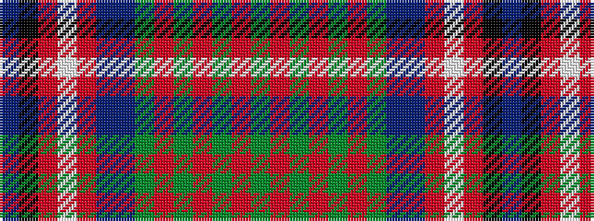

BKRWRBBGRGRGRG

It is a 14 stripe tartan.

<figure class="pat-woven">

<figcaption>idealised sample</figcaption>
</figure>

## Colour Sequence



## Tartans with this colour sequence

| Tartans |
|---------------|
| [Hill 70](/setts/s14/t18k1r1w1r4db4t4dg4r1dg1r1dg1r1dg1~x4/)|
||
| [Hill 70](/setts/s14/t18k1r1w1r4db4t4g4r1g1r1g1r1g1~x4/)|
||
