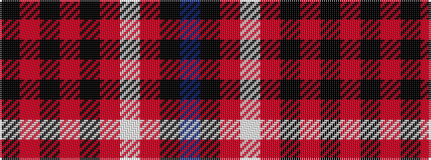

BKRWRKRKRK

It is a 10 stripe tartan.

<figure class="pat-woven">

<figcaption>idealised sample</figcaption>
</figure>

## Colour Sequence



## Tartans with this colour sequence

| Tartans |
|---------------|
| [Noordermeer (Personal)](/setts/s10/k64r1k4r1k6r7w2r7k6t2~x2/)|
||
