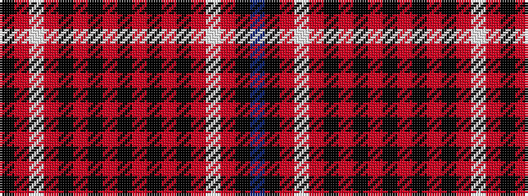

BKRWRKRKRKRKRKRWRK

It is a 18 stripe tartan.

<figure class="pat-woven">

<figcaption>idealised sample</figcaption>
</figure>

## Colour Sequence



## Tartans with this colour sequence

| Tartans |
|---------------|
| [Noordermeer Personal Tartan](/variants/s18/k6m7w2m7k6m1k4m1k64m1k4m1k6m7w2m7k6t2~x2/)|
||
