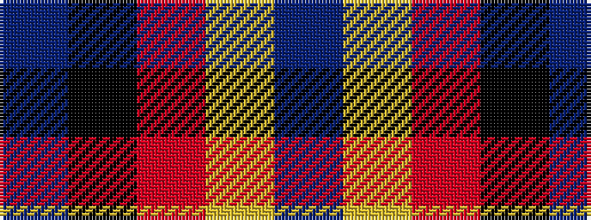

BKRYB

It is a 5 stripe tartan.

<figure class="pat-woven">

<figcaption>idealised sample</figcaption>
</figure>

## Colour Sequence



## Tartans with this colour sequence

| Tartans |
|---------------|
| [Ikelman #2 (Personal)](/variants/s5/n11k4r4lo4n1~x4/)|
||
| [Ikelman #3a (Personal)](/variants/s5/n11k4r4lo4n11~x4/)|
||
| [Prince of Orange](/variants/s5/db6lo25o16k2db3~x2/)|
||
